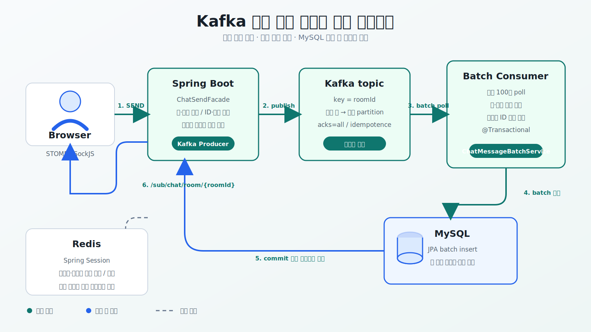
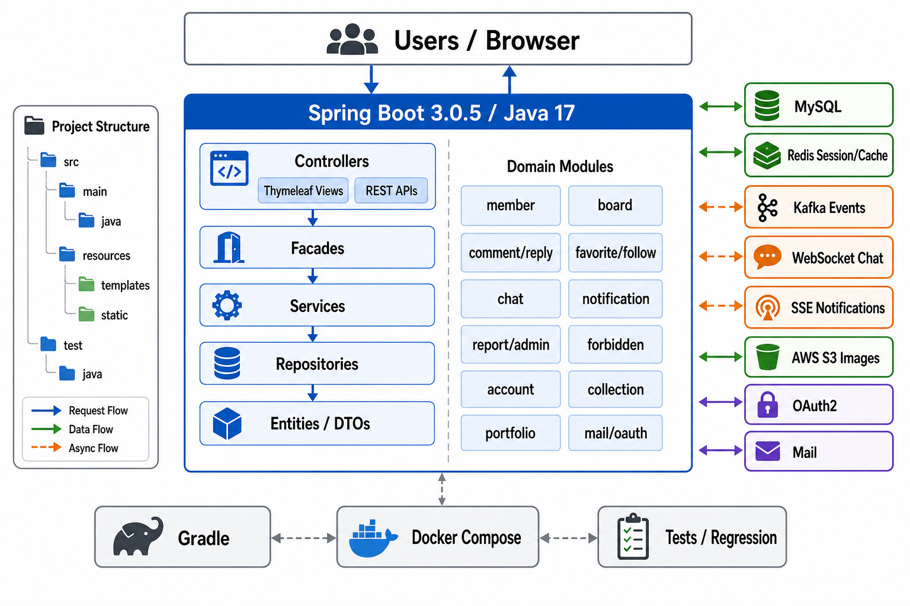

# Study Backend Project

Spring Boot 기반 커뮤니티 서비스입니다.

게시글, 댓글/대댓글, 좋아요, 회원/팔로우, 실시간 채팅, 알림, 신고/관리자, 금칙어, 계좌 거래 기능을 제공합니다. Redis, Kafka, WebSocket, SSE, AWS S3를 활용해 세션 관리, 비동기 이벤트 처리, 실시간 통신, 이미지 업로드를 구현했습니다.

[운영 서비스 URL](https://www.kwanwoo.site)

## 목차

- [프로젝트 목표](#프로젝트-목표)
- [시스템 아키텍처](#시스템-아키텍처)
- [채팅 처리 흐름](#채팅-처리-흐름)
- [주요 기능](#주요-기능)
- [기술 스택](#기술-스택)
- [실행 방법](#실행-방법)
- [테스트](#테스트)
- [주요 경로](#주요-경로)
- [Kafka 및 Redis 사용 이유](#kafka-및-redis-사용-이유)
- [관리 메모](#관리-메모)

## 프로젝트 목표

단순 CRUD 게시판을 넘어 실제 서비스 운영에 필요한 인증, 실시간 통신, 비동기 처리, 관리자 기능을 구현하는 것을 목표로 개발했습니다.

- WebSocket 기반 실시간 채팅
- Kafka 기반 채팅/알림 이벤트 처리
- Redis 기반 세션 관리, 온라인 상태 관리, 캐싱
- SSE 기반 실시간 알림 스트림
- OAuth2 기반 소셜 로그인
- AWS S3 이미지 업로드
- 관리자용 회원/신고/금칙어 관리
- Docker Compose 기반 로컬 실행 환경

## 시스템 아키텍처



프로젝트의 주요 패키지 구조와 애플리케이션 레이어는 아래 다이어그램처럼 구성되어 있습니다.



- Spring Boot 애플리케이션은 Thymeleaf 화면과 REST API를 함께 제공합니다.
- MySQL은 회원, 게시글, 댓글, 채팅방, 알림, 신고, 계좌 거래 등 주요 데이터를 저장합니다.
- Redis는 JWT Refresh Token, 온라인 사용자 및 채팅방 접속 상태, 캐싱에 사용합니다.
- Kafka는 채팅 메시지의 영속화 버퍼와 알림 이벤트 채널로 사용합니다.
- 채팅 메시지는 방 ID를 Kafka key로 발행해 같은 방의 처리 순서를 유지합니다.
- Kafka Consumer는 메시지를 최대 100건씩 가져와 MySQL에 JPA batch insert하고, 저장이 끝난 메시지만 WebSocket으로 전달합니다.
- SSE는 알림을 클라이언트에 실시간 스트림으로 전달합니다.
- AWS S3는 게시글, 채팅, 프로필, 컬렉션 이미지 저장소로 사용합니다.

## 채팅 처리 흐름

```text
Browser
  └─ STOMP SEND /api/chat/message/send
       └─ ChatSendFacade: 방/회원 검증, 메시지 ID·시간 부여, 알림 생성
            └─ Kafka Producer: topic, key=roomId
                 └─ Batch Consumer: 최대 100건 poll
                      └─ ChatMessageBatchService (@Transactional)
                           ├─ 채팅방·회원 일괄 조회
                           ├─ 메시지 ID 중복 제거
                           ├─ MySQL JPA batch insert
                           └─ 채팅방 마지막 메시지·시간 갱신
                                └─ commit 후 /sub/chat/room/{roomId} 브로드캐스트
```

- Producer는 `acks=all`, idempotence를 활성화해 Kafka 발행 안정성을 높였습니다.
- 같은 채팅방의 메시지는 `roomId`를 key로 사용해 동일 partition에 기록되므로 방별 순서를 유지합니다.
- Consumer는 `max.poll.records=100`과 batch listener를 사용하며, Hibernate JDBC batch와 MySQL `rewriteBatchedStatements`를 함께 적용합니다.
- 저장 전에 이미 존재하는 메시지 ID와 같은 poll 안의 중복 ID를 제외해 재처리 시 중복 저장을 방지합니다.
- DB 저장과 채팅방 요약 갱신이 끝난 메시지만 WebSocket으로 전송해 조회 데이터와 실시간 화면의 순서를 맞춥니다.

## 배포 구조

```text
Internet
   |
AWS Load Balancer
   |
Spring Boot Server (EC2)
   |
   +-- MySQL
   +-- Redis
   +-- Kafka
   +-- S3
```

## 주요 기능

### 회원

- 회원가입, 로그인, 로그아웃
- Google/Naver OAuth2 로그인
- 세션 기반 인증
- 회원 정보 조회/수정, 비밀번호/휴대폰 변경, 회원 탈퇴
- 회원 검색
- 팔로우/팔로잉/팔로워 조회

### 게시글

- 게시글 작성, 조회, 수정, 삭제
- 이미지 업로드
- 댓글/대댓글
- 좋아요
- 컬렉션 저장
- 조회수 관리

### 채팅

- 채팅방 생성 및 목록 조회
- WebSocket 기반 실시간 메시지 전송
- 이미지 메시지 업로드
- Redis 기반 채팅방 접속 상태 관리
- Kafka room key 기반 채팅방별 메시지 순서 보장
- Kafka batch Consumer와 JPA batch insert 기반 메시지 저장
- 메시지 ID 기반 중복 저장·중복 렌더링 방지
- DB 저장 후 WebSocket 브로드캐스트

### 알림

- Kafka 기반 알림 이벤트 발행/소비
- SSE 기반 실시간 알림 스트림
- 읽지 않은 알림 수 조회
- 알림 그룹별 조회
- 배치 기반 알림 처리

### 신고/관리자

- 게시글/댓글 등 대상 신고
- 신고 내역 조회 및 관리자 처리
- 금칙어 등록/검토/승인
- 온라인 회원, 신규 회원, 신규 게시글, 활성 채팅 등 관리자 대시보드 API

### 계좌

- 계좌 생성 및 목록 조회
- 계좌 이체
- 거래 내역 조회
- 거래 타입/상태 관리

## 기술 스택

### Backend

- Java 17
- Spring Boot 3.0.5
- Spring Security
- Spring Data JPA
- JWT Refresh Token
- Spring WebSocket
- Spring Kafka
- Thymeleaf

### Database / Storage

- MySQL 8.0
- Redis 7.2
- AWS S3
- H2(Test Runtime)

### Infra / DevOps

- Docker
- Docker Compose
- Gradle
- AWS EC2
- AWS Load Balancer

## 실행 방법

### 사전 준비

- Java 17
- Docker / Docker Compose
- MySQL, Redis, Kafka가 필요합니다. Docker Compose를 사용하면 함께 실행됩니다.
- 이미지 업로드와 OAuth 로그인을 사용하려면 AWS S3, Google OAuth2, Naver OAuth2 설정이 필요합니다.

### Docker Compose

`.env` 파일에 MySQL root 비밀번호를 설정합니다.

```env
MYSQL_ROOT_PASSWORD=your-password
```

애플리케이션과 인프라 컨테이너를 함께 실행합니다.

```bash
docker-compose up -d --build
```

실행 후 `http://localhost:8080`으로 접속합니다.

### 로컬 jar 실행

MySQL, Redis, Kafka를 먼저 실행한 뒤 애플리케이션을 빌드합니다.

```bash
./gradlew clean build
java -jar build/libs/study-0.0.1-SNAPSHOT.jar
```

테스트를 제외하고 빠르게 빌드하려면 다음 명령을 사용할 수 있습니다.

```bash
./gradlew clean build -x test
```

## 테스트

전체 테스트:

```bash
./gradlew test
```

회귀 테스트:

```bash
./gradlew regressionTest
```

## 주요 경로

### 화면

- `/` : 메인
- `/member/login` : 로그인
- `/member/register` : 회원가입
- `/board/main` : 게시글 메인
- `/board/all` : 게시글 목록
- `/board/write` : 게시글 작성
- `/chat/chatList` : 채팅방 목록
- `/notification/list` : 알림 목록
- `/favorites` : 좋아요 목록
- `/collection` : 컬렉션
- `/account` : 계좌
- `/account/transfer` : 이체
- `/admin/administrator` : 관리자
- `/portfolio` : 포트폴리오

### API

- `/api/member/**` : 회원
- `/api/board/**` : 게시글
- `/api/boardImg/**` : 게시글 이미지
- `/api/comment/**` : 댓글
- `/api/reply/**` : 대댓글
- `/api/favorite/**` : 좋아요
- `/api/follow/**` : 팔로우
- `/api/chat/**` : 채팅
- `/api/notification/**` : 알림
- `/api/report/**` : 신고
- `/api/forbidden/word/**` : 금칙어
- `/api/account/**` : 계좌
- `/api/admin/**` : 관리자
- `/api/mail/**` : 메일 인증

### WebSocket / SSE

- WebSocket endpoint: `/ws/chat`
- Chat publish mapping: `/api/chat/message/send`
- Subscribe prefix: `/sub`
- Notification SSE: `/api/notification/stream`

## Kafka 및 Redis 사용 이유

### Kafka

채팅 및 알림 시스템에서 이벤트 처리의 확장성을 확보하기 위해 Kafka를 도입했습니다. 채팅에서는 Kafka가 메시지 영속화 버퍼 역할도 담당합니다.

```text
기존 방식: WebSocket 요청 -> Kafka -> WebSocket 전송 -> Redis 임시 저장 -> 5초 Scheduler -> DB 저장
현재 방식: WebSocket 요청 -> Kafka(roomId key) -> Batch Consumer -> MySQL batch 저장 -> WebSocket 전송
```

이를 통해 다음 효과를 얻었습니다.

- 서비스 간 결합도 감소
- 채팅/알림 처리 비동기화
- 고트래픽에서 Kafka Consumer와 JDBC batch로 메시지당 DB 저장 비용 절감
- 방별 메시지 순서 유지 및 메시지 ID 기반 중복 저장 방지
- DB에 저장된 메시지만 실시간 전송해 저장·전달 순서 일치
- 이벤트 처리 실패 지점 분리

### Redis

Redis는 다음 용도로 사용합니다.

- JWT Refresh Token 저장소
- 온라인 사용자 상태 관리
- 채팅방 접속 상태 관리
- 게시글 등 조회 데이터 캐싱

이를 통해 다음 효과를 얻었습니다.

- 로그인 세션 공유
- 서버 확장 시 세션 유지
- DB 조회 감소
- 실시간 상태 조회 성능 개선

## 관리 메모

### JWT 인증 설정

- Access Token은 `HttpOnly` 쿠키에 15분간 저장됩니다.
- Refresh Token은 `HttpOnly` 쿠키로 전달하고, 활성 토큰의 `jti`는 Redis에서 14일간 관리합니다.
- 운영 환경에서는 최소 32바이트의 `JWT_SECRET`을 반드시 설정하고 `security.jwt.secure-cookie=true`로 실행해야 합니다.
- 설정 예시는 `src/main/resources/application-jwt.example.properties`를 참고합니다.

- Docker Compose의 애플리케이션 컨테이너는 `db`, `redis`, `kafka` 서비스명을 사용하도록 환경 변수를 주입합니다.
- JPA 설정은 현재 `ddl-auto=update`입니다. 운영 환경에서는 마이그레이션 도구나 명시적인 DDL 관리 방식으로 전환하는 것이 안전합니다.
