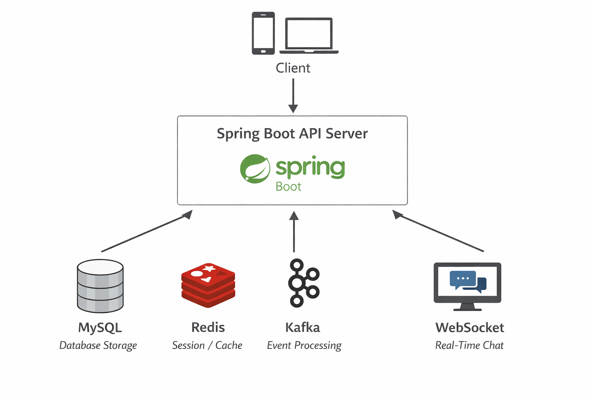

# Study Backend Project

Spring Boot 기반 커뮤니티 서비스입니다. 

게시글, 채팅, 알림, 금칙어 기능을 제공하며 Redis, Kafka, WebSocket을 활용하여 비동기 이벤트 처리와 실시간 통신을 구현했습니다.

현재 AWS 환경에 배포하여 실제로 운영 중에 있는 서비스입니다.
[운영 서비스 URL](https://www.kwanwoo.site)

## 목차
- [프로젝트목표](#프로젝트 목표)
- [시스템 아키텍처](#시스템 아키텍처)
- [배포 구조](#배포 구조)
- [실행 방법](#실행 방법)
- [기술 스택](#기술 스택)
- [주요 기능](#주요 기능)
- [트러블슈팅](#Kafka 및 Redis 사용 이유(트러블슈팅))

## 프로젝트 목표

단순 CRUD 게시판 구현이 아닌 실제 서비스 환경에서 필요한 기능을 구현하는 것을 목표로 개발했습니다.

- 실시간 채팅 서비스 구현(WebSocket)
- 이벤트 기반 알림 및 채팅 시스템 구축(Kafka)
- Redis 기반 세션 관리 및 캐싱 처리
- OAuth2 기반 로그인 지원
- AWS 환경 배포

## 시스템 아키텍처

- Redis를 이용하여 세션을 관리하여 서버 확장성을 확보했습니다.
- Kafka를 이용하여 알림 이벤트를 비동기적으로 처리했습니다.
- WebSocket을 사용하여 채팅 메시지를 실시간으로 전달합니다.

## 배포 구조
            Internet
                |
        AWS Load Balancer
                |
      Spring Boot Server (EC2)
                |
    ┌───────────┼────────────┐───────────┐
    │           │            │           │
    MySQL       Redis       Kafka       S3

## 실행 방법

### Docker
> docker-compose up -d

### jar
> ./gradlew build 
> java -jar ./build/libs/study.jar

## 기술 스택

### Backend
- Java 17
- Spring Boot 3.0.5
- Spring Security
- Spring Data JPA
- WebSocket

### Database
- MySQL
- Redis

### Message Queue
- Apache Kafka

### Infra
- AWS EC2
- AWS S3
- LoadBalancer

### DevOps
- Docker
- Gradle

## 주요 기능

### 회원 기능
- 회원가입/로그인
- OAuth2 로그인
- 세션 기반 인증
- 팔로우

### 게시글
- 게시글 작성/수정/삭제
- 댓글/대댓글
- 게시글 조회
- 좋아요

### 채팅
- WebSocket 기반 실시간 채팅

### 알림
- Kafka 기반 이벤트 알림

### Kafka 및 Redis 사용 이유(트러블슈팅)
- Kafka 
> 채팅 및 알림 시스템에서 이벤트 처리의 확장성을 확보히기 위해 Kafka를 도입
> 
>> 기존 방식: API → DB 저장 → 알림 처리
>
>> Kafka 적용 후: API → Kafka Event 발행 → Consumer가 비동기 처리
> 
> 이를 통해 다음과 같은 장점을 얻었습니다.
> - 서비스 간의 결합도 감소
> - 비동기 이벤트 처리
> - 트래픽 증가 시 확장 가능

- Redis
> Redis를 다음 용도로 사용
> >1. 세션 저장소
> >2. 캐싱
> 
> Redis를 사용함으로써 다음과 같은 효과를 얻었습니다.
> - 로그인 세션 관리
> - DB 조회 감소
> - 응답 속도 개선