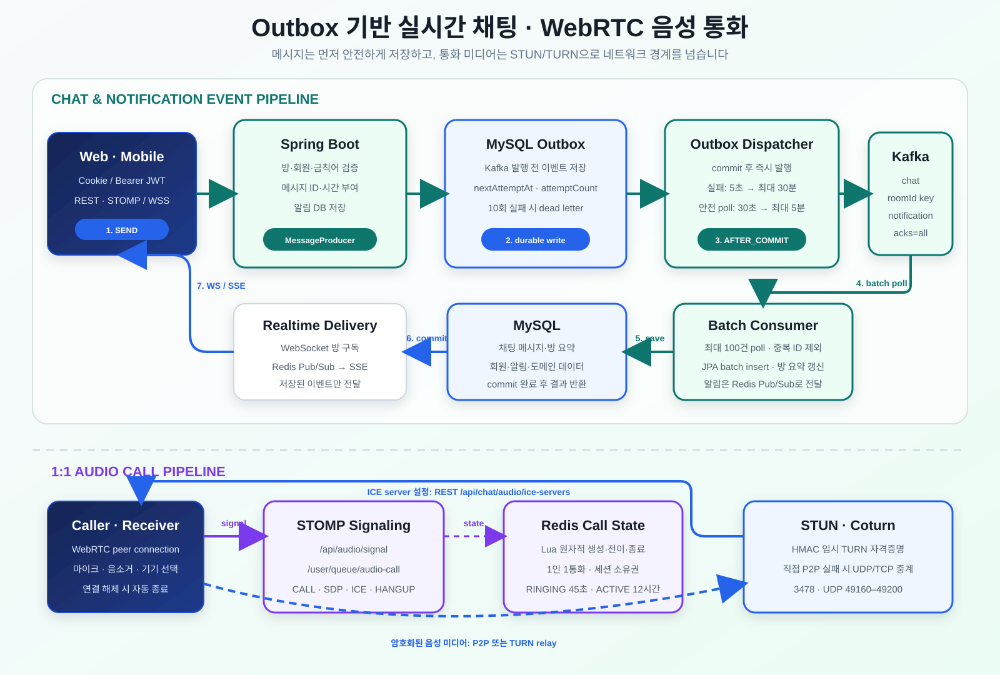

# Study Backend Project

Spring Boot 3.0.5와 Java 17로 구현한 웹·모바일 커뮤니티 서비스입니다.

소셜 피드, 실시간 채팅·알림, 1:1 WebRTC 음성 통화, 계좌 상품, 신고·제재·상소와 관리자 운영 기능을 제공합니다. MySQL outbox, Kafka, Redis, WebSocket, SSE, Coturn, AWS S3를 조합해 이벤트 유실 복구와 네트워크 간 실시간 통신까지 구현했습니다.

[운영 서비스](https://www.kwanwoo.site) · [웹 포트폴리오](https://www.kwanwoo.site/portfolio)

> 현재 통화 기능은 **1:1 음성 통화**까지 구현되어 있습니다. 영상 통화는 아직 포함하지 않습니다.

## 목차

- [프로젝트 핵심](#프로젝트-핵심)
- [시스템 아키텍처](#시스템-아키텍처)
- [채팅 및 알림 처리 흐름](#채팅-및-알림-처리-흐름)
- [1:1 음성 통화 흐름](#11-음성-통화-흐름)
- [주요 기능](#주요-기능)
- [웹과 모바일 인증](#웹과-모바일-인증)
- [기술 스택](#기술-스택)
- [실행 방법](#실행-방법)
- [TURN 배포 설정](#turn-배포-설정)
- [테스트](#테스트)
- [주요 경로](#주요-경로)
- [운영 및 장애 대응](#운영-및-장애-대응)

## 프로젝트 핵심

- Thymeleaf 웹과 iOS/Android 앱이 같은 도메인 API를 사용합니다.
- 웹은 `HttpOnly` Cookie JWT, 모바일은 Bearer JWT와 Refresh Token 회전 방식을 사용합니다.
- 채팅·알림 이벤트는 Kafka 발행 전에 MySQL outbox에 기록해 Kafka 장애 시에도 복구할 수 있습니다.
- 채팅은 `roomId`를 Kafka key로 사용하고 최대 100건을 batch 저장한 뒤 WebSocket으로 전달합니다.
- 알림은 Kafka Consumer가 Redis Pub/Sub에 전달하고 각 서버 인스턴스가 SSE 연결로 전송합니다.
- 1:1 음성 통화는 STOMP로 시그널링하고 WebRTC 미디어는 P2P 또는 Coturn으로 전달합니다.
- Redis Lua script로 통화 생성·상태 전이·종료를 원자적으로 처리합니다.
- 관리자 화면에서 시스템 자원, outbox 대기/dead letter, 장애 IP와 반복 횟수, 통화 강제 종료를 관리합니다.

## 시스템 아키텍처



```text
Web / iOS / Android
  ├─ REST / Thymeleaf
  ├─ STOMP WebSocket
  └─ SSE
          │
          ▼
Spring Boot Application
  ├─ MySQL : 도메인 데이터, JWT Refresh Token, Kafka outbox
  ├─ Redis : 회원·채팅방 접속 상태, 통화 상태, 캐시, 알림 Pub/Sub
  ├─ Kafka : 채팅·알림 이벤트 전달 및 채팅 batch 소비
  ├─ AWS S3 : 게시글·채팅·프로필·컬렉션·다이어리 이미지
  └─ Coturn : WebRTC 직접 연결 실패 시 음성 미디어 중계
```

### 저장소별 책임

| 구성 요소 | 책임 |
| --- | --- |
| MySQL | 회원, 게시글, 댓글, 채팅, 알림, 신고, 제재, 상소, 계좌와 outbox 영속화 |
| Redis | 온라인·채팅방 접속 상태, 회원 캐시, 통화 상태/TTL, 알림 Pub/Sub |
| Kafka | 채팅·알림 이벤트 비동기 전달, `roomId` key 기반 채팅 순서 유지 |
| AWS S3 | 서비스 이미지 저장 |
| Coturn | 서로 다른 NAT/방화벽 환경에서 WebRTC 미디어 relay |

Redis는 채팅 메시지 임시 큐로 사용하지 않습니다. 전달 전 이벤트는 MySQL outbox에 저장하고 최종 채팅 메시지는 MySQL에 영속화합니다.

## 채팅 및 알림 처리 흐름

### 채팅

```text
Web STOMP / Mobile REST
  └─ ChatSendFacade
       ├─ 방·회원·금칙어 검증
       ├─ 메시지 ID와 등록 시각 부여
       ├─ 미접속 사용자 알림 생성
       └─ KafkaOutboxEvent를 MySQL에 저장
            └─ 저장/트랜잭션 commit 후 즉시 dispatch 요청
                 └─ Kafka topic (key = roomId)
                      └─ Batch Consumer (최대 100건)
                           └─ ChatMessageBatchService @Transactional
                                ├─ 방·회원 일괄 조회
                                ├─ 메시지 ID 기준 중복 저장 방지
                                ├─ JPA batch insert
                                └─ 채팅방 마지막 메시지·시간 갱신
                                     └─ commit된 결과를 /sub/chat/room/{roomId}로 전송
```

- Producer는 `acks=all`, idempotence, `max.in.flight.requests.per.connection=5`를 사용합니다.
- 같은 방의 메시지는 `roomId` key를 사용하므로 같은 partition에 기록됩니다.
- Consumer는 batch listener와 `max.poll.records=100`을 사용합니다.
- Hibernate JDBC batch와 insert 순서 정렬을 사용해 메시지 저장 비용을 줄입니다.
- 이미 저장된 메시지 ID와 같은 poll 안의 중복 ID는 다시 insert하지 않습니다.
- MySQL 저장 트랜잭션을 마친 결과만 WebSocket 방 구독자에게 전달합니다.

모바일은 `POST /api/chat/send`, 웹은 STOMP `/api/chat/message/send`를 사용하지만 이후 outbox/Kafka 처리 흐름은 같습니다.

### Kafka outbox 복구 정책

```text
이벤트 생성
  └─ MySQL outbox 저장
       ├─ commit 후 즉시 Kafka 발행
       └─ 실패 시 nextAttemptAt 기록
            ├─ 5초부터 최대 30분까지 지수 백오프
            ├─ 10회 실패 시 dead letter
            └─ 누락 복구용 안전 poll: 30초 → 1분 → 2분 → 4분 → 최대 5분
```

- Dispatcher는 한 번에 최대 100건의 발행 가능한 이벤트만 잠금 조회합니다.
- 이벤트가 생성되면 1개 scheduler thread에서 즉시 발행하므로 상시 1초 polling을 하지 않습니다.
- 작업이 없을수록 안전 poll 간격을 늘리고, 작업이 발견되면 초기 간격으로 돌아갑니다.
- Kafka 장애 중에는 다음 재시도 시각까지 전역 발행을 잠시 막아 반복 연결 비용을 줄입니다.
- 성공한 outbox 행은 삭제하고, dead letter는 관리자 대시보드의 queue 지표로 확인합니다.

설정 override가 필요한 경우 다음 속성을 사용합니다.

```properties
kafka.outbox.safety-poll-initial-ms=30000
kafka.outbox.safety-poll-max-ms=300000
kafka.outbox.retry-base-delay-ms=5000
kafka.outbox.retry-max-delay-ms=1800000
```

### 알림

```text
도메인 트랜잭션
  └─ Notification + KafkaOutboxEvent 저장
       └─ commit 후 Kafka topic2 발행
            └─ Consumer → Redis Pub/Sub notification-events
                 └─ 각 애플리케이션 인스턴스 → 사용자 SSE 연결
```

알림 저장과 outbox 저장을 같은 트랜잭션에 포함하며, 읽지 않은 개수·그룹별 조회·전체 읽음·개별 읽음 기능을 제공합니다. 채팅, 좋아요, 신고/관리자, 음성 통화 등의 알림 그룹을 지원합니다.

## 1:1 음성 통화 흐름

```text
Caller / Receiver
  ├─ STOMP /api/audio/signal
  │    └─ Spring Boot → /user/queue/audio-call
  │         └─ CALL / ACCEPT / REJECT / OFFER / ANSWER / ICE_CANDIDATE / HANGUP
  ├─ Redis AudioCallStateStore
  │    └─ RINGING → CONNECTING → ACTIVE → 종료
  └─ WebRTC media
       ├─ STUN으로 직접 P2P 연결 시도
       └─ 실패하면 Coturn UDP/TCP relay
```

- 통화는 참여자가 2명인 1:1 채팅방에서만 시작할 수 있습니다.
- `RINGING` 상태 TTL은 45초이며, 통화 중 상태 TTL은 12시간입니다.
- Redis Lua script가 발신자·수신자 키와 통화 상태를 함께 변경해 1인 1통화를 보장합니다.
- 통화를 시작하거나 받은 WebSocket session만 SDP, ICE, 종료 신호를 보낼 수 있습니다.
- 통화 중 `KEEP_ALIVE`로 TTL을 갱신하고 WebSocket 연결 해제 시 상대에게 종료 신호를 보냅니다.
- 수신자가 다른 화면에 있어도 실시간 알림과 `GET /api/chat/audio/incoming`으로 수신 통화를 복원할 수 있습니다.
- 관리자는 `DELETE /api/admin/chat/audio-call/{callId}`로 비정상 통화를 강제 종료할 수 있습니다.
- `GET /api/chat/audio/ice-servers`는 로그인 회원에게만 만료 시간이 있는 HMAC TURN 자격증명을 발급합니다.
- 음성 데이터는 Spring Boot나 Kafka에 저장하지 않으며 WebRTC P2P 또는 TURN relay로만 흐릅니다.

## 주요 기능

### 회원 및 인증

- 회원가입, 로그인, 로그아웃, 회원 검색과 프로필
- Google/Naver OAuth2 로그인
- 웹 `HttpOnly` JWT Cookie와 모바일 Bearer JWT
- Access Token 갱신 시 Refresh Token 회전 및 이전 token 폐기
- 활성 Refresh Token의 `jti`와 만료 시각을 MySQL에 저장
- 메일 인증을 거친 비밀번호 변경
- 휴대폰 번호, 프로필 공개 범위 변경과 회원 탈퇴
- 팔로우/언팔로우, 팔로잉·팔로워 조회

### 게시글, 관계와 기록

- 게시글 작성·조회·수정·삭제와 조회수
- AWS S3 이미지 업로드 및 정리 작업
- 좋아요 API와 좋아요 사용자 모달
- 댓글·대댓글 작성·수정·삭제와 전체 댓글 모달
- 개인 컬렉션 저장
- 이미지 다이어리 작성·검색·수정·삭제

### 채팅과 알림

- 채팅방 생성, 1:1 채팅방, 목록·이전 메시지 cursor 조회
- 웹 STOMP와 모바일 REST 메시지 전송
- 채팅 이미지, 메시지 수정, 나에게/모두에게 삭제
- Redis 기반 채팅방 접속·읽음 상태
- MySQL outbox, Kafka room key, batch Consumer 기반 저장
- SSE 실시간 알림, 읽지 않은 개수, 그룹별 조회와 읽음 처리
- 1:1 WebRTC 음성 통화, 수신 알림, 음소거·입출력 장치 선택과 강제 종료

### 신고, 제재, 상소와 관리자

- 게시글·댓글·회원 등 대상 신고와 중복 신고 방지
- 신고 처리 상태, 관리자 메모, 경고·일시정지·차단 제재 이력
- 접수 대기 중인 본인 신고 취소
- 회원의 본인 제재 조회와 상소 제출, 관리자의 상태별 상소 조회
- 금칙어 신청·검토·승인과 위험도 누적 정책
- 온라인 회원, 신규 회원, 신규 게시글, 최근 활성 채팅 지표
- CPU, 메모리, 디스크, JVM, 접속, outbox/dead letter, 이미지 정리 queue 표시
- 서버 장애의 요청 경로·HTTP method·IP·예외·반복 횟수 저장 및 확인 처리

### 계좌

- 입출금, 정기예금, 적금 계좌 생성
- 계좌 입금·이체·이름 변경과 거래 내역
- 거래 취소 시 소유자·상태·기간을 검증하고 반대 거래 생성
- 예금·적금 금리, 만기, 누적 예상 이자 표시
- 적금 월 자동이체와 잔액 부족 알림
- 예금·적금 해지 시 원금과 이자를 지정 계좌로 정산

## 웹과 모바일 인증

서버를 웹용과 앱용으로 나누지 않습니다. 같은 Spring Security filter와 도메인 API를 사용하되 token 전달 방식만 구분합니다.

| 클라이언트 | Access Token | Refresh Token | 로그인 API |
| --- | --- | --- | --- |
| Web | `HttpOnly` Cookie | `HttpOnly` Cookie + MySQL jti | `/api/member/**`, OAuth2 redirect |
| Mobile | `Authorization: Bearer ...` | 응답 body + MySQL jti | `/api/mobile/auth/login`, `/refresh`, `/logout` |

모바일 OAuth는 `/api/mobile/auth/oauth/{provider}`로 시작하고 성공 후 일회용 code를 `/api/mobile/auth/oauth/exchange`에서 앱 token으로 교환합니다. WebSocket도 별도 모바일 서버가 필요하지 않으며 인증된 연결에서 동일한 `/ws/chat` endpoint와 STOMP destination을 사용할 수 있습니다.

## 기술 스택

### Backend

- Java 17
- Spring Boot 3.0.5
- Spring MVC, Validation, AOP, Thymeleaf
- Spring Security, OAuth2 Client, JWT, BCrypt
- Spring Data JPA, Hibernate JDBC batch
- Spring WebSocket/STOMP, SockJS, SSE
- Spring Kafka

### Data, realtime 및 storage

- MySQL 8.0
- Redis 7.2
- Kafka, Zookeeper
- WebRTC, STUN, Coturn
- AWS S3
- H2 test runtime

### Infra 및 test

- Docker, Docker Compose
- Gradle
- AWS EC2, Load Balancer
- JUnit 5, Spring Boot Test, Spring Security Test, Spring Kafka Test
- JavaScript/template regression test

## 실행 방법

### 사전 준비

- Java 17
- Docker와 Docker Compose
- Docker Compose를 사용하지 않으면 MySQL, Redis, Kafka를 별도로 실행해야 합니다.
- 이미지/OAuth/메일/TURN 기능은 각 외부 서비스 설정이 필요합니다.

### Docker Compose

저장소 root에 commit하지 않는 `.env` 파일을 만들고 배포 환경 값을 입력합니다.

```env
MYSQL_ROOT_PASSWORD=<database-password>

TURN_SHARED_SECRET=<cryptographically-secure-random-secret>
TURN_REALM=turn.example.com
TURN_EXTERNAL_IP=<turn-server-public-ip>
WEBRTC_TURN_URLS=turn:turn.example.com:3478?transport=udp,turn:turn.example.com:3478?transport=tcp
```

`TURN_SHARED_SECRET`은 임의의 짧은 문자열이 아니라 충분히 긴 암호학적 난수를 사용하고 애플리케이션과 Coturn에 같은 값을 주입해야 합니다. `TURN_EXTERNAL_IP`에는 클라이언트가 인터넷에서 접근할 TURN 서버의 공인 IPv4 또는 Elastic IP를 넣습니다.

```bash
docker-compose up -d --build
```

애플리케이션은 기본적으로 `http://localhost:8080`에서 실행됩니다.

### 애플리케이션 설정

운영 배포 전 다음 설정을 실제 환경 값 또는 환경 변수 placeholder로 연결해야 합니다. 비밀값은 저장소에 commit하지 않습니다.

```properties
# database / redis / kafka
spring.datasource.url=<jdbc-url>
spring.datasource.username=<database-user>
spring.datasource.password=<database-password>
spring.data.redis.host=<redis-host>
spring.data.redis.port=<redis-port>
bootstrap-servers=<kafka-bootstrap-servers>
group-id=<kafka-consumer-group>

# authentication
security.jwt.secret=<at-least-32-byte-secret>
security.jwt.issuer=<issuer>
security.jwt.access-token-minutes=<minutes>
security.jwt.refresh-token-days=<days>
security.jwt.secure-cookie=true

# WebRTC ICE
webrtc.ice.stun-url=<stun-url>
webrtc.ice.turn-urls=<comma-separated-turn-urls>
webrtc.ice.turn-shared-secret=<same-value-as-coturn>
webrtc.ice.turn-credential-ttl-seconds=<seconds>
```

AWS S3, Google/Naver OAuth2와 mail 계정도 각 환경의 property 또는 secret manager로 주입해야 합니다.

### 로컬 jar 실행

```bash
./gradlew clean build
java -jar build/libs/study-0.0.1-SNAPSHOT.jar
```

테스트를 제외한 빌드:

```bash
./gradlew clean build -x test
```

Windows PowerShell에서는 `./gradlew` 대신 `.\gradlew.bat`를 사용할 수 있습니다.

## TURN 배포 설정

STUN만으로는 대칭 NAT, 회사/통신사 방화벽 등 일부 네트워크에서 직접 연결할 수 없습니다. 서로 다른 네트워크 간 통화를 안정적으로 제공하려면 공인 IP가 있는 Coturn과 relay port가 필요합니다.

### AWS Security Group

| 유형 | Port | Source | 용도 |
| --- | --- | --- | --- |
| TCP | 3478 | `0.0.0.0/0` | TURN over TCP |
| UDP | 3478 | `0.0.0.0/0` | TURN/STUN 요청 |
| UDP | 49160-49200 | `0.0.0.0/0` | 음성 미디어 relay |

`49160-49200`은 **41개의 UDP port**를 하나의 port range rule로 여는 것입니다. Security Group rule을 41개 만들 필요는 없습니다. IPv6 클라이언트까지 직접 허용하려면 동일 rule에 `::/0`도 별도로 검토합니다.

`203.0.113.10` 같은 주소는 문서 예시용 TEST-NET IP이므로 실제 서버에서 동작하지 않습니다. 반드시 EC2 public/Elastic IP로 교체해야 합니다.

추가 확인 사항:

- EC2 Security Group뿐 아니라 OS firewall과 Docker port mapping도 같은 범위를 허용해야 합니다.
- NAT 환경의 TURN 서버는 `external-ip`에 실제 public IP를 지정해야 합니다.
- `TURN_SHARED_SECRET`과 `webrtc.ice.turn-shared-secret` 값은 정확히 같아야 합니다.
- 운영 웹은 HTTPS, WebSocket은 WSS로 제공해야 브라우저가 마이크 사용을 허용합니다.
- 장기적으로 3478 TCP/UDP와 5349 TLS TURN을 함께 제공하면 제한적인 네트워크 대응 범위가 넓어집니다.

## 테스트

전체 테스트:

```bash
./gradlew test
```

회귀 테스트:

```bash
./gradlew regressionTest
```

주요 테스트 범위는 계좌 상품·이자·자동이체, 신고·상소, JWT와 비밀번호 변경 인증, Kafka outbox, 채팅 batch 저장, 음성 통화 signaling/Redis 상태, API security, template/static JavaScript 회귀입니다.

## 주요 경로

### 화면

- `/` : 메인
- `/member/login`, `/member/register` : 로그인·회원가입
- `/member/detail`, `/member/search` : 내 정보·회원 검색
- `/board/main`, `/board/all`, `/board/write` : 게시글
- `/chat/chatList`, `/chat/chatRoom` : 채팅과 음성 통화
- `/notification/list` : 알림
- `/favorites`, `/collection` : 좋아요·컬렉션
- `/diary`, `/diary/write` : 다이어리
- `/account`, `/account/transfer`, `/account/transactions` : 계좌
- `/report`, `/report/my`, `/appeal` : 신고·내 신고·상소
- `/admin/administrator` : 관리자 대시보드
- `/admin/forbidden/word/apply` : 금칙어 적용 검토
- `/admin/appeal` : 상소 목록
- `/portfolio` : 웹 포트폴리오

### REST API

- `/api/mobile/auth/**` : 모바일 로그인·token 회전·OAuth 교환
- `/api/member/**` : 회원·비밀번호 인증
- `/api/board/**`, `/api/boardImg/**` : 게시글·이미지
- `/api/comment/**`, `/api/reply/**` : 댓글·대댓글
- `/api/favorite/**`, `/api/follow/**`, `/api/collection/**` : 관계·저장
- `/api/diary/**` : 다이어리
- `/api/chat/**` : 채팅, 모바일 메시지, 접속 상태, ICE server, 수신 통화
- `/api/notification/**` : 알림·SSE
- `/api/report/**`, `/api/appeal/**` : 신고·상소
- `/api/forbidden/word/**` : 금칙어
- `/api/account/**` : 계좌·거래·해지
- `/api/admin/**` : 관리자·시스템 상태·장애·통화 종료
- `/api/mail/**` : 메일 인증

### WebSocket 및 SSE

- SockJS/STOMP endpoint: `/ws/chat`
- 메시지 publish: `/api/chat/message/send`
- 음성 signaling publish: `/api/audio/signal`
- 채팅방 subscribe: `/sub/chat/room/{roomId}`
- 사용자 통화 subscribe: `/user/queue/audio-call`
- 알림 SSE: `/api/notification/stream`

## 운영 및 장애 대응

### 관리자 시스템 상태

`GET /api/admin/system/status`는 다음 항목을 제공합니다.

- 시스템/process CPU
- 시스템 메모리와 JVM heap
- disk 사용량과 JVM uptime
- 온라인 session과 활성 채팅방 접속 수
- Kafka outbox pending/dead letter 수
- S3 image cleanup pending 수

### 서버 장애 기록

처리되지 않은 서버 예외는 `system_incident`에 저장합니다.

- 발생 시각, HTTP method, 요청 경로와 status
- `X-Forwarded-For` → `X-Real-IP` → remote address 순서로 추출한 요청 IP
- 예외 유형과 메시지
- 같은 미확인 장애의 반복 발생 횟수
- 관리자 확인 여부와 확인 시각

최근 50건은 `GET /api/admin/system/incidents`, 확인 처리는 `PATCH /api/admin/system/incidents/{id}/acknowledge`에서 제공합니다. 클라이언트 연결 종료에 따른 `ClientAbortException`과 일반 `IOException`은 장애 DB에 쌓지 않고 debug log로 처리합니다.

### 운영 보안

- 운영 `JWT_SECRET`은 최소 32바이트 난수로 설정합니다.
- HTTPS 환경에서는 `security.jwt.secure-cookie=true`를 유지합니다.
- OAuth, AWS, database, mail, JWT, TURN secret을 source code나 README에 기록하지 않습니다.
- JPA 설정은 현재 `ddl-auto=update`이므로 운영에서는 migration 도구나 명시적 DDL 관리 방식으로 전환하는 것이 안전합니다.
- 만료된 Refresh Token과 비활성 회원 token은 scheduler가 정리합니다.
